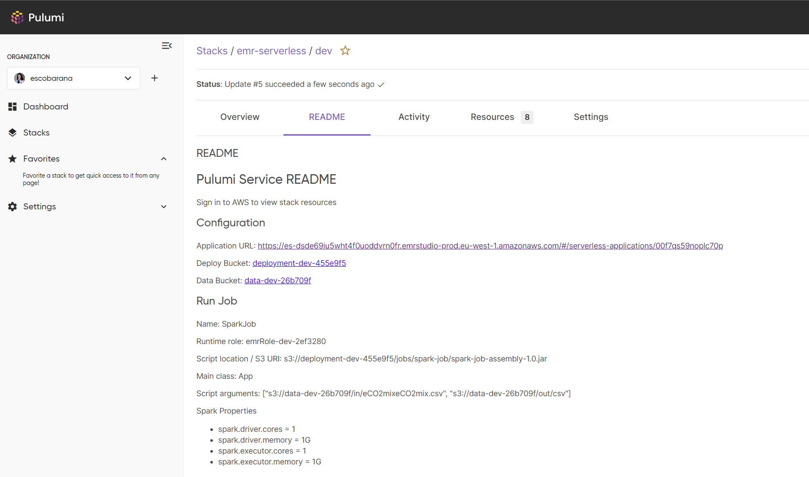
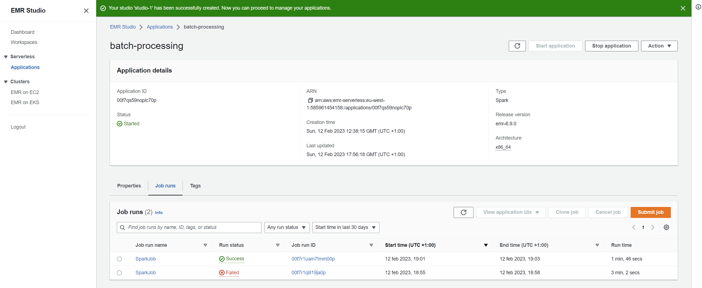
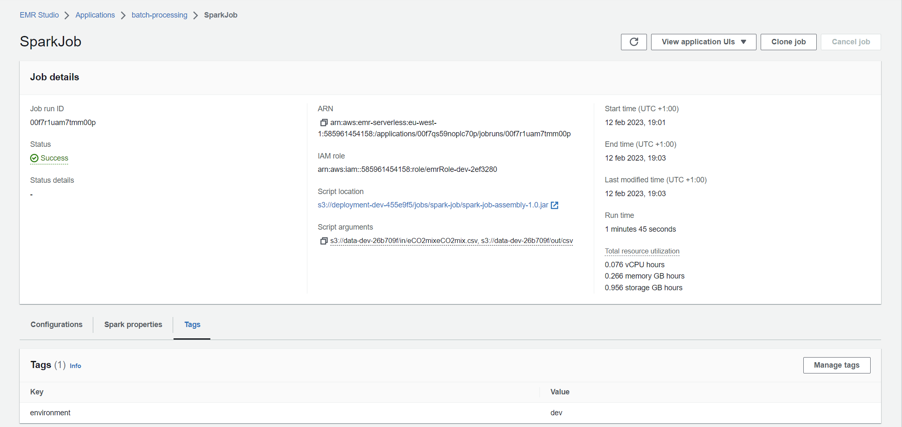
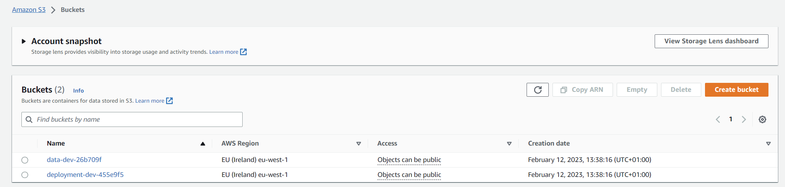
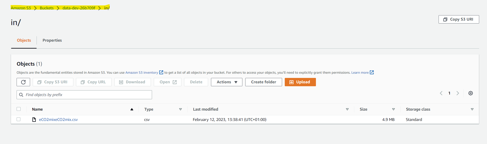
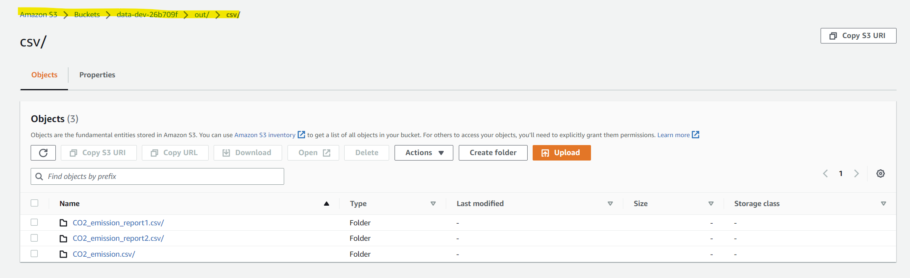
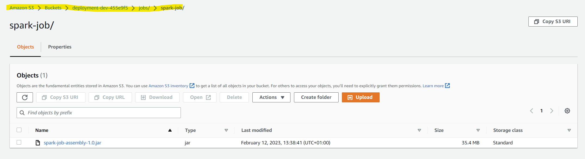
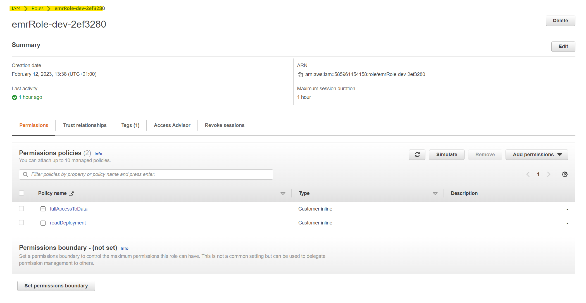
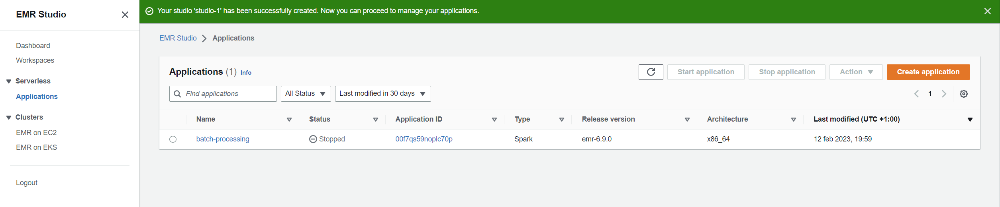

# Batch processing in Spark using SBT tool and AWS EMR

## Author
Ana Escobar Llamazares - [ana.escobar-llamazares@edu.dsti.institute](mailto:ana.escobar-llamazares@edu.dsti.institute)


## Description
Batch Spark job of CO2 Emission data using SBT tool.

According to Wikipedia : “Réseau de Transport d'Électricité ("Electricity Transmission Network"), usually known as RTE, is the electricity transmission system operator of France.”

source: https://en.wikipedia.org/wiki/R%C3%A9seau_de_Transport_d'%C3%89lectricit%C3%A9

According to https://www.rte-france.com/en/eco2mix/co2-emissions, the contribution of each energy source to C02 emissions is as follows:
- 0.986 t CO2 eq /MWh for coal-fired plants (Charbon)
- 0.777 t CO2 eq /MWh for oil-fired plants (Fioul)
- 0.429 t CO2 eq /MWh for gas-fired plants (Gaz)
- 0.494 t CO2 eq /MWh for biofuel plants (waste)


## Input
The electricity production data for 2020 published at https://eco2mix.rte-france.com/download/eco2mix/eCO2mix_RTE_Annuel-Definitif_2020.zip


## Output
The output are three CSV files:
- [CO2_emission.csv](data/CO2_emission.csv) file with columns : `Date`,`Time`,`Oil_CO2`,`Coal_CO2` for each data point
- [CO2_emission_report1.csv](data/CO2_emission_report1.csv) with columns : `Date`,`Time`,`Coal_CO2_greater_than_Oil_CO2` for each data point
- [CO2_emission_report2.csv](data/CO2_emission_report2.csv) with columns: `Date`,`Coal_CO2_greater_than_Oil_CO2` for each day

When run locally, these files will be stored in the [data](data) folder of the project.


## Structure of the project

    ├── .github                     : CI/CD pipeline using GitHub Actions
    |  └── workflows                : Contains yml files that trigger the workflows in GitHub Actions.
    |       ├── pulumi-preview.yml 
    |       ├── pulumi-up.yml 
    |       ├── release.yml 
    |       └── sbt-tests.yml 
    ├── data                         : Folder containing the input data and the output data
    |   ├── CO2_emission.csv
    |   ├── C02_emission_report1.csv
    |   ├── CO2_emission_report2.csv
    |   └── eco2mix_RTE_Annuel-Definitif_2020.csv
    ├── images                        : Folder containing all the images used in the README.md files.
    ├── project                       : Folder containing the SBT project : Further explanations on IaC part
    ├── pulumi-iac                    : Infrastructure as Code using Pulumi
    |   ├── index.ts
    |   ├── package.json
    |   ├── package-lock.json
    |   ├── Pulumi.dev.yml
    |   ├── Pulumi.README.md
    |   ├── Pulumi.yml
    |   └── tsconfig.json
    ├── src                             : Folder containing the source code of the project
    |   ├── main
    |   |   ├─── resources
    |   |   |   └─── log4j.properties
    |   |   └─── scala
    |   |         └─── App.scala
    ├── target                           : Folder containing the compiled JAR file
    |   ├── ...
    |   ├── scala-2.12
    |   |   ├── ...
    |   |   ├── spark-job-assembly-1.0.jar
    |   ├── ...
    ├── .gitignore                       
    ├── .scalafmt.conf                        
    ├── build.sbt
    └── README.md                  


# Getting started
## Clone the project
```bash
git clone https://github.com/escobarana/sbt_spark_batch.git
```
or with `SSH`:
```bash
git clone git@github.com:escobarana/sbt_spark_batch.git
```


## Pre-requisites
You need to have stored the following secrets in your GitHub repository in order to run the GitHub Actions workflows:
- `AWS_ACCESS_KEY_ID`
- `AWS_SECRET_ACCESS_KEY`
- `AWS_REGION`
- `PULUMI_ACCESS_TOKEN`
- `MY_GITHUB_TOKEN`

You can find more information about how to create a GitHub token at https://docs.github.com/en/github/authenticating-to-github/creating-a-personal-access-token


## Run the project locally
This Job Spark Project needs to be compiled into a JAR for running via `spark-submit`.


### Build the JAR
```bash
sbt assembly
```


### Run
### Option 1: with spark-submit
```bash
spark-submit --class App target/scala-2.12/spark-job-assembly-1.0.jar data/eCO2mix_RTE_Annuel-Definitif_2020.csv data
```


### Option 2: with SBT
```bash
sbt run --class App target/scala-2.12/spark-job-assembly-1.0.jar data/eCO2mix_RTE_Annuel-Definitif_2020.csv data
```

I have configured a workflow through GitHub Actions that builds and test the project with `SBT` every time a new commit is pushed to the `master` and `develop` branches or pull-request to `main`. You can find it
at the [sbt-tests.yml](.github/workflows/sbt-tests.yml) file.


## Project Release
I have created a release with the tag `v1.0.0` where the JAR file is available as well as the input csv file. This release gets
updated automatically every time a new commit is pushed to the `master` branch thanks to `GitHub Actions`. You
can have a look at the workflow at the [release.yml](.github/workflows/release.yml) file.


## Run the project on AWS EMR
AWS resources needed:
- EMR cluster
- Two S3 buckets
- EMR Serverless Application
- IAM role

First, you need to create and EMR cluster. You can do it with the AWS CLI or with the AWS Console.

**Don't forget to run first `aws configure` to set up your AWS credentials.**

```bash
aws emr create-cluster --name "Spark Cluster" --release-label emr-5.29.0 --applications Name=Spark --ec2-attributes KeyName=spark-cluster --instance-type m5.xlarge --instance-count 3 --use-default-roles
```

You will get the `EMR Studio ID` as output. You will need this ID to create the EMR Serverless Application. You need to modify
the [index.ts](pulumi-iac/index.ts) file and replace the `emrstudioAppId` constant with your own.

The rest of the AWS resources are created using `Pulumi`, a modern infrastructure as code tool. You can find the code in the `pulumi-iac` folder.
You can access the `README.md` at https://app.pulumi.com/escobarana/emr-serverless/dev/readme and have a look at the other tabs (`Overview`, `Activity`, `Resources`) as well.


### Set up the AWS resources using Pulumi 
After creating the EMR cluster, you need to set up the Pulumi project. You need to have `Pulumi` installed on your machine.
You can find more information about how to install it at https://www.pulumi.com/docs/get-started/install/

```bash
cd pulumi-iac
pulumi login
pulumi preview
pulumi up
```

If you want to destroy all the resources created, you can run:
```bash
pulumi destroy
```

This process is currently done automatically using `GitHub Actions`. You can have a look at the workflow at the [pulumi-preview.yml](.github/workflows/pulumi-preview.yml) and [pulumi-up.yml](.github/workflows/pulumi-up.yml) files.

On every `push` to the `develop` branch and `pull-request` to the `main` branch, the workflow will run and preview the resources. On every `push` to the `master` branch, the workflow will create the resources.

After this process, you will have the following resources created:
- EMR Studio
- Two S3 buckets
- EMR Serverless Application
- IAM role

Now, you can create a new `Job` in the EMR console. Select the `EMR Serverless Application` that you have created. Click on `Submit job` and configure 
the properties as specified in the `Pulumi README` under the `Run Job` title: https://app.pulumi.com/escobarana/emr-serverless/dev/readme



You can find more information about how to create a `Job` in the EMR console at https://docs.aws.amazon.com/emr/latest/ManagementGuide/emr-managed-notebooks-jobs.html






## Set up the AWS resources without Pulumi
If you don't want to use `Pulumi`, you can create the resources manually with the AWS CLI or with the AWS Console.
You will need to create the same resources as mentioned before:
- EMR Studio
- Two S3 buckets
- EMR Serverless Application
- IAM role

You can find in the AWS documentation how to create each resource:
- EMR Studio: https://docs.aws.amazon.com/emr/latest/ManagementGuide/emr-studio.html
- S3 bucket: https://docs.aws.amazon.com/AmazonS3/latest/userguide/create-bucket-overview.html
- EMR Serverless Application: https://docs.aws.amazon.com/emr/latest/ManagementGuide/emr-managed-notebooks-jobs.html
- IAM role: https://docs.aws.amazon.com/IAM/latest/UserGuide/id_roles_create.html


Here, I attach screenshots of the resources created with the AWS Console.




















## Further explanations - strategy of computation
### [CO2_emission.csv](data/CO2_emission.csv)
`CO2 emissions for the coal / oil using the provided data`

The approach I followed was:
1. Load input csv file into a `DataFrame` using encoding `ISO-8859-1`
2. Filter the `Dataframe` by `Date`, `Heures`, `Fioul` and `Charbon` since these are the needed columns
3. Rename the column `Heures` to `Time`
4. Replace missing values in all the columns with `0.0`
5. Overwrite column `Date` by casting it to `DateType` and `DateFormat("dd/MM/yyyy")`
6. Create new column `Coal_CO2` by multiplying the `Charbon` column by 0.986 as referred in the introduction of the project
7. Create new column `Oil_CO2` by multiplying the `Oil` column by 0.777 as referred in the introduction of the project
8. Finally, select only the columns `Date`, `Time`, `Coal_CO2` and `Oil_CO2` and save the result to a new csv file named `CO2_emission.csv`

Results on AWS: https://s3.console.aws.amazon.com/s3/buckets/data-dev-26b709f?region=eu-west-1&prefix=out/csv/CO2_emission.csv/&showversions=false

### [CO2_emission_report1.csv](data/CO2_emission_report1.csv)
`Report for each 15mn period if the CO2_emission_coal > CO2_emission_oil`

The approach I followed was:
1. Load input csv file into a `DataFrame` using encoding `ISO-8859-1`
2. Filter the `Dataframe` by `Date`, `Heures`, `Fioul` and `Charbon` since these are the needed columns
3. Rename the column `Heures` to `Time`
4. Replace missing values in all the columns with `0.0`
5. Overwrite column `Date` by casting it to `DateType` and `DateFormat("dd/MM/yyyy")`
6. Create new column `Coal_CO2` by multiplying the `Charbon` column by 0.986 as referred in the introduction of the project
7. Create new column `Oil_CO2` by multiplying the `Oil` column by 0.777 as referred in the introduction of the project
8. Group the `DataFrame` by `Date` and `Time` and sum the values of `Coal_CO2` and `Oil_CO2` and give them aliases `CO2_emission_coal` and `CO2_emission_oil` respectively
9. Create a new column named `Coal_CO2_greater_than_Oil_CO2` by comparing the values of `CO2_emission_coal` and `CO2_emission_oil` and casting the result to `BooleanType`
10. Finally, select only the columns `Date`, `Time` and `Coal_CO2_greater_than_Oil_CO2` and save the result to a new csv file named `CO2_emission_report1.csv`

Results on AWS: https://s3.console.aws.amazon.com/s3/buckets/data-dev-26b709f?region=eu-west-1&prefix=out/csv/CO2_emission_report1.csv/&showversions=false

### [CO2_emission_report2.csv](data/CO2_emission_report2.csv)
`Report for each day if the CO2_emission_coal > CO2_emission_oil`

The approach I followed was:
1. Load input csv file into a `DataFrame` using encoding `ISO-8859-1`
2. Filter the `Dataframe` by `Date`, `Heures`, `Fioul` and `Charbon` since these are the needed columns
3. Rename the column `Heures` to `Time`
4. Replace missing values in all the columns with `0.0`
5. Overwrite column `Date` by casting it to `DateType` and `DateFormat("dd/MM/yyyy")`
6. Create new column `Coal_CO2` by multiplying the `Charbon` column by 0.986 as referred in the introduction of the project
7. Create new column `Oil_CO2` by multiplying the `Oil` column by 0.777 as referred in the introduction of the project
8. Group the `DataFrame` by `Date` and sum the values of `Coal_CO2` and `Oil_CO2` and give them aliases `CO2_emission_coal` and `CO2_emission_oil` respectively
9. Create a new column named `Coal_CO2_greater_than_Oil_CO2` by comparing the values of `CO2_emission_coal` and `CO2_emission_oil` and casting the result to `BooleanType`
10. Finally, select only the columns `Date` and `Coal_CO2_greater_than_Oil_CO2` and save the result to a new csv file named `CO2_emission_report2.csv`

Results on AWS: https://s3.console.aws.amazon.com/s3/buckets/data-dev-26b709f?region=eu-west-1&prefix=out/csv/CO2_emission_report2.csv/&showversions=false


## Final remarks
The initial input file had the extension `.xsl` and I had to convert it to `.csv` to be able to read it with `Spark` since I couldn't find a library  
that successfully loaded the file after several attempts. You can find all the libraries that I tried out in the `build.sbt` file.
